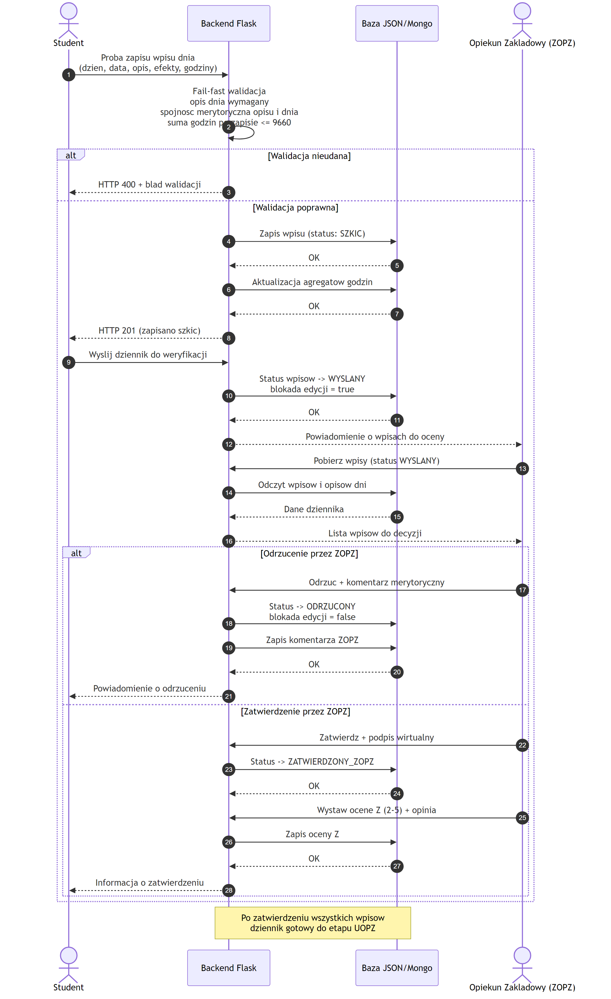
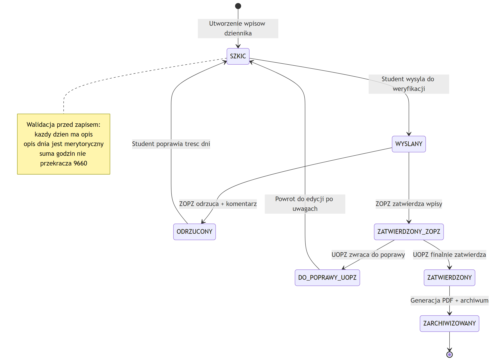
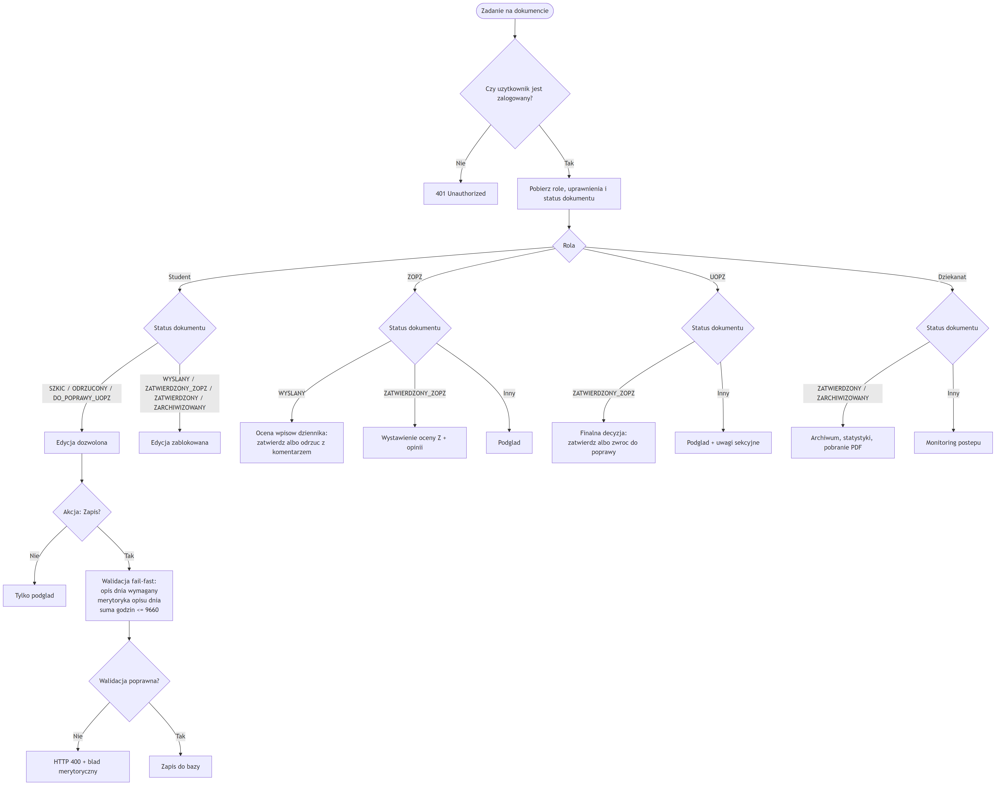
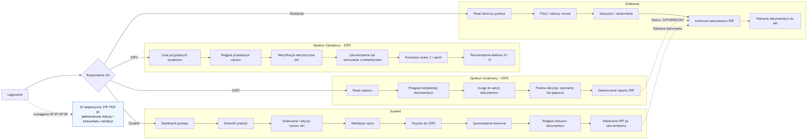
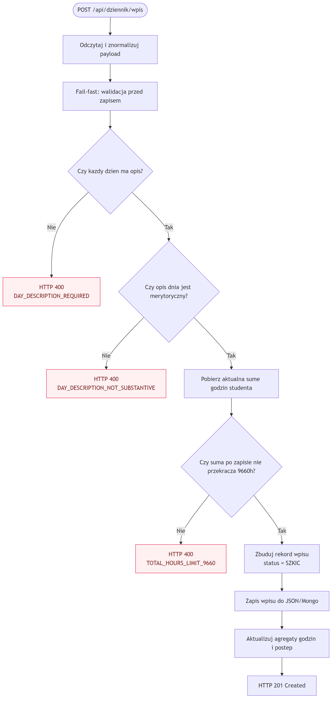
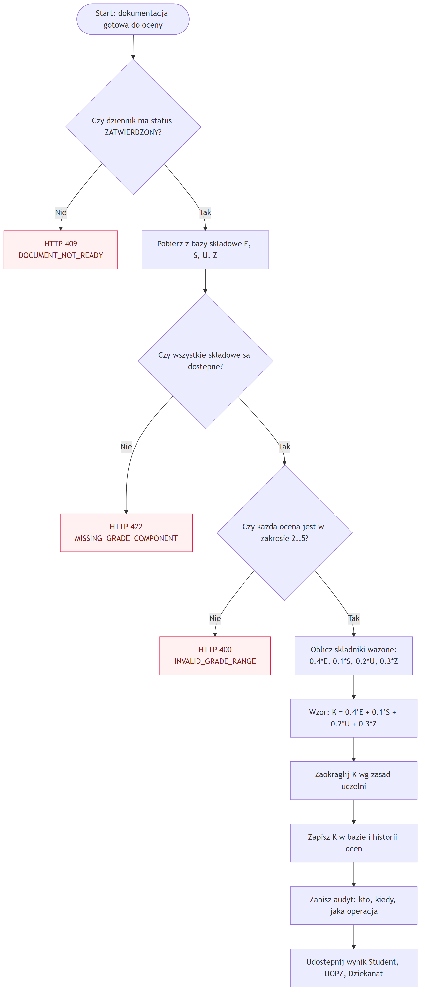
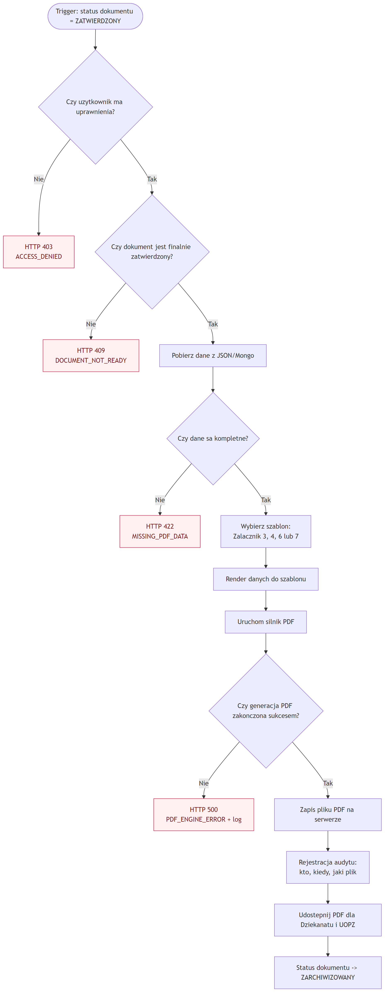

	<h1>Flask App Form</h1>
	
<strong>System cyfrowego obiegu dokumentacji praktyk zawodowych</strong>

	

		<a href="documentation/dokumentacja.pdf"><strong>Przejdz do dokumentacji PDF</strong></a>
		&nbsp;|&nbsp;
	

---

	<h2>O Projekcie</h2>
	

		Flask App Form odwzorowuje pelny cykl dokumentowania praktyk studenckich w jednej aplikacji webowej.
		Projekt zostal przygotowany tak, aby zastapic tradycyjny obieg papierowy procesem cyfrowym,
		przejrzystym i latwym do monitorowania przez wszystkie role zaangazowane w realizacje praktyki.
	

	

		Rozwiazanie obejmuje tworzenie i edycje dziennika praktyk, przekazanie dokumentow do wieloetapowej
		weryfikacji, obsluge uwag i poprawek, wystawianie ocen czastkowych oraz finalnych,
		a nastepnie generowanie dokumentow PDF gotowych do archiwizacji.
	

	

		Model procesu i logika aplikacji zostaly opracowane na podstawie dokumentacji analitycznej
		zapisanej w pliku main(1).tex, z zachowaniem rzeczywistego workflow ról:
		Student, Opiekun Zakladowy (ZOPZ), Opiekun Uczelniany (UOPZ), Dziekanat.
	

---

	<h2>Zakres Funkcjonalny</h2>
	<table>
		<thead>
			<tr>
				<th>Obszar</th>
				<th>Opis</th>
			</tr>
		</thead>
		<tbody>
			<tr>
				<td>Dziennik praktyk</td>
				<td>Tworzenie wpisow dziennych, powiazanie z efektami uczenia sie, kontrola statusu wpisow.</td>
			</tr>
			<tr>
				<td>Workflow i statusy</td>
				<td>Przejscia miedzy SZKIC, WYSLANY, ODRZUCONY, ZATWIERDZONY_ZOPZ, DO_POPRAWY_UOPZ, ZATWIERDZONY, ZARCHIWIZOWANY.</td>
			</tr>
			<tr>
				<td>Weryfikacja i oceny</td>
				<td>Ocena merytoryczna wpisow, uwagi opiekunow, wystawianie oceny Z oraz obliczanie oceny koncowej K.</td>
			</tr>
			<tr>
				<td>PDF i archiwizacja</td>
				<td>Generowanie dokumentow zgodnych z zalacznikami oraz przekazanie do archiwum dziekanatu.</td>
			</tr>
			<tr>
				<td>Panel zbiorczy</td>
				<td>Widoki administracyjne dla monitorowania statusow, raportowania i obslugi dokumentacji.</td>
			</tr>
		</tbody>
	</table>

---

	<h2>Diagramy Systemowe (PNG)</h2>
	
Komplet 7 diagramow Mermaid wygenerowanych na podstawie main(1).tex.

	<h3>1. Sequence - Proces weryfikacji dziennika</h3>
	

	<h3>2. State - Cykl zycia dokumentu</h3>
	

	<h3>3. Flow - RBAC i logika uprawnien</h3>
	

	<h3>4. Flow - Interfejs i nawigacja UI</h3>
	

	<h3>5. Flow - Logika walidacji wpisu</h3>
	

	<h3>6. Flow - Algorytm oceny koncowej</h3>
	

	<h3>7. Flow - Generowanie PDF i archiwizacja</h3>
	

---

	<h2>Pliki Mermaid</h2>
	<table>
		<thead>
			<tr>
				<th>Nr</th>
				<th>Nazwa diagramu</th>
				<th>Plik zrodlowy</th>
			</tr>
		</thead>
		<tbody>
			<tr>
				<td>1</td>
				<td>Sequence Diary Verification</td>
				<td>documentation/diagrams/diagrams_code/Sequence_Diary_Verification.mmd</td>
			</tr>
			<tr>
				<td>2</td>
				<td>State Document Lifecycle</td>
				<td>documentation/diagrams/diagrams_code/State_Document_Lifecycle.mmd</td>
			</tr>
			<tr>
				<td>3</td>
				<td>RBAC Permissions</td>
				<td>documentation/diagrams/diagrams_code/Flow_RBAC_Permissions.mmd</td>
			</tr>
			<tr>
				<td>4</td>
				<td>UI Navigation</td>
				<td>documentation/diagrams/diagrams_code/Flow_UI_Navigation.mmd</td>
			</tr>
			<tr>
				<td>5</td>
				<td>Business Logic Validation</td>
				<td>documentation/diagrams/diagrams_code/Flow_Business_Logic_Validation.mmd</td>
			</tr>
			<tr>
				<td>6</td>
				<td>Final Grade Algorithm</td>
				<td>documentation/diagrams/diagrams_code/Flow_Final_Grade_Algorithm.mmd</td>
			</tr>
			<tr>
				<td>7</td>
				<td>PDF Generation</td>
				<td>documentation/diagrams/diagrams_code/Flow_PDF_Generation.mmd</td>
			</tr>
		</tbody>
	</table>

