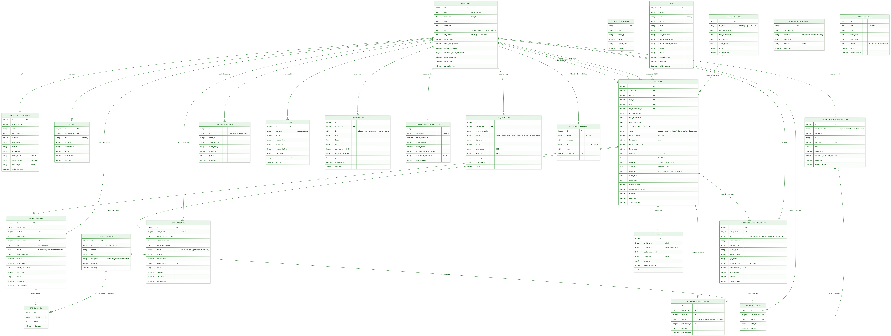
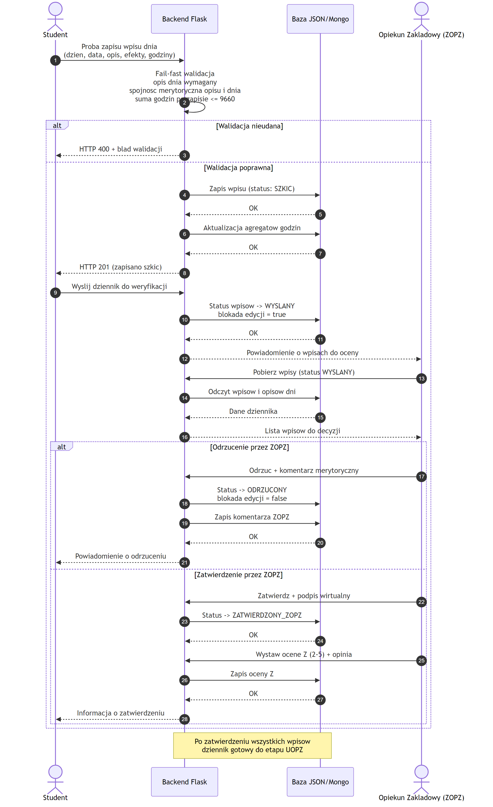
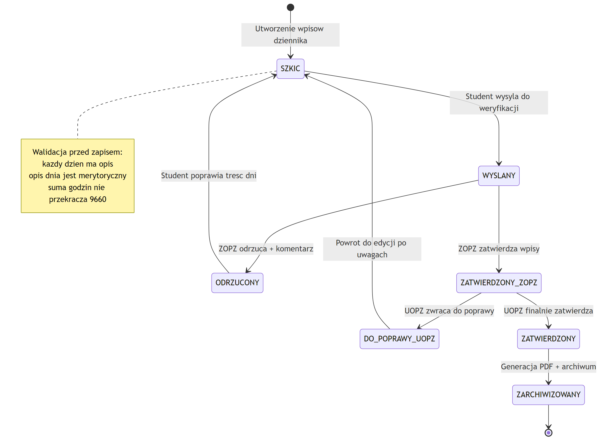
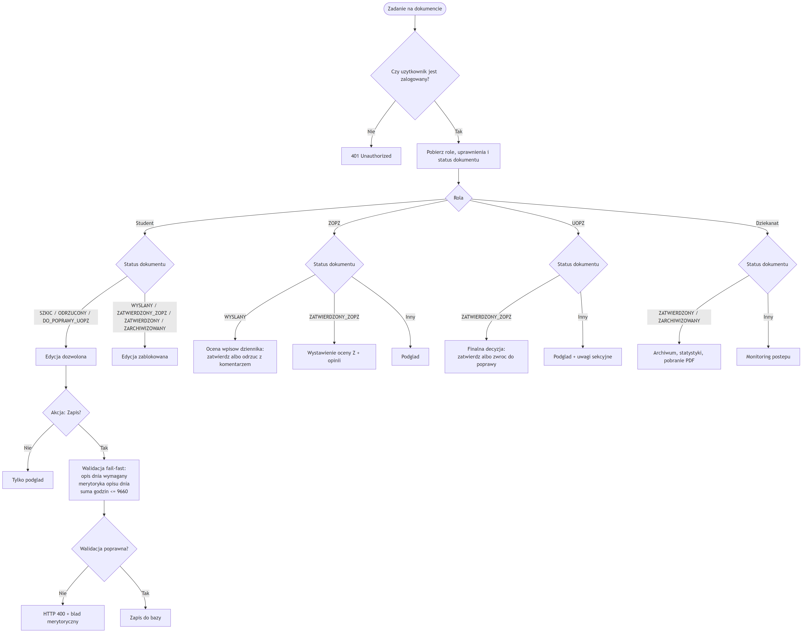
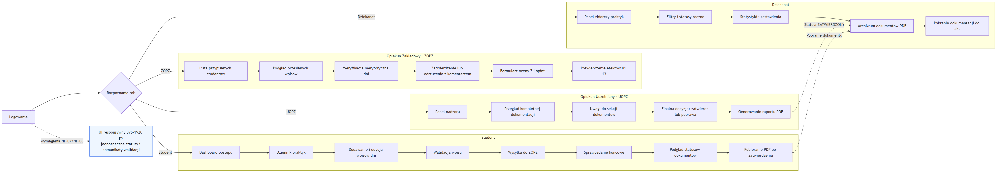
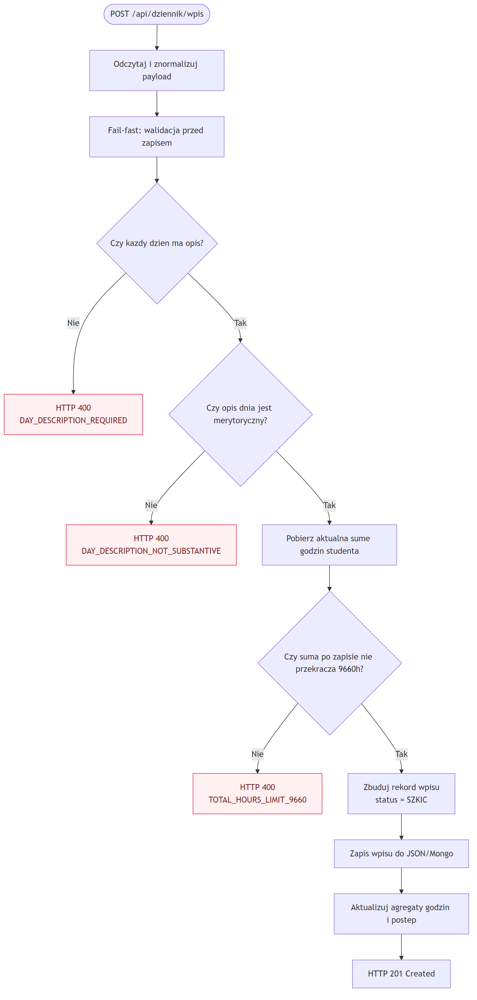
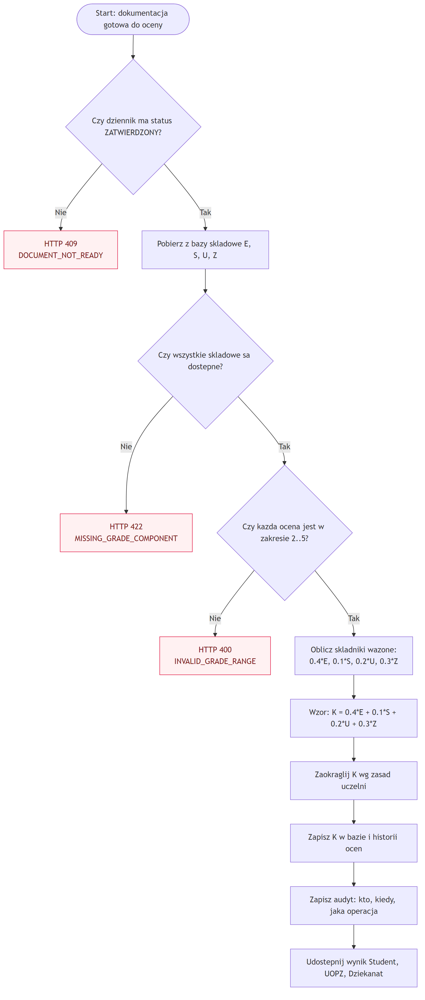
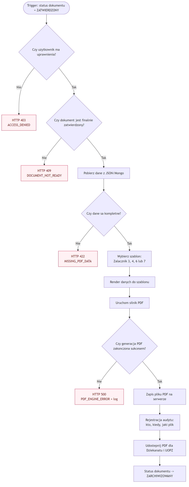

<div align="center">
    <h1>Flask App Form</h1>
    <p><strong>System cyfrowego obiegu dokumentacji praktyk zawodowych</strong></p>
    <table>
        <thead>
            <tr>
                <th>Rodzaj dokumentacji</th>
                <th>Plik</th>
            </tr>
        </thead>
        <tbody>
            <tr>
                <td>Dokumentacja analityczna projektu</td>
                <td><a href="documentation/01_dokumentacja_analityczna.pdf"><strong>Pobierz PDF</strong></a></td>
            </tr>
            <tr>
                <td>Dokumentacja dotycząca bazy danych</td>
                <td><a href="documentation/02_dokumentacja_bazy_danych.pdf"><strong>Pobierz PDF</strong></a></td>
            </tr>
            <tr>
                <td>Dokumentacja i testy frontendu</td>
                <td><a href="documentation/testy-ui/ETAP_10A_TESTY_UI.md"><strong>Otwórz raport</strong></a></td>
            </tr>
            <tr>
                <td>Dokumentacja i testy PDF</td>
                <td><a href="documentation/testy-pdf/ETAP_11A_TESTY_PDF.md"><strong>Otwórz raport</strong></a></td>
            </tr>
        </tbody>
    </table>

</div>

---

## Stan implementacji

- 79 testów jednostkowych i integracyjnych oraz 12 scenariuszy Playwright;
- wiele części praktyki w jednym roku akademickim;
- ocena końcowa liczona i zapisywana po stronie serwera;
- PDF generowany wyłącznie z zatwierdzonej rewizji i wersjonowany;
- archiwizacja ZIP, retencja oraz anonimizacja;
- panel administracyjny, import studentów CSV i raport postępu;
- logowanie uczelniane przez single-tenant Microsoft Entra ID;
- produkcyjny Docker Compose z Nginx/TLS, prywatnymi bazami, backupem,
  monitoringiem i uwierzytelnionym MongoDB;
- `app.py` zawiera fabrykę aplikacji, a trasy są rejestrowane przez Blueprinty.

Uruchomienie deweloperskie opisuje [CLAUDE.md](CLAUDE.md), a wdrożenie
produkcyjne [documentation/WDROZENIE_PRODUKCYJNE.md](documentation/WDROZENIE_PRODUKCYJNE.md).
Dokumentacja interfejsu znajduje się w
[documentation/FRONTEND.md](documentation/FRONTEND.md), a raport etapu 10A w
[documentation/testy-ui/ETAP_10A_TESTY_UI.md](documentation/testy-ui/ETAP_10A_TESTY_UI.md).
Testy i przykłady generatora PDF opisuje
[documentation/testy-pdf/ETAP_11A_TESTY_PDF.md](documentation/testy-pdf/ETAP_11A_TESTY_PDF.md).

### Testy interfejsu

Testy Playwright uruchamiają Chromium i Firefox, sprawdzają formularze,
walidację, responsywność oraz pełny CRUD studentów wykonywany przez frontend
na REST API. Zrzuty ekranów są zapisywane w
`documentation/testy-ui/screenshots`.

```powershell
docker-compose -f docker-compose.e2e.yml up --build `
  --abort-on-container-exit --exit-code-from e2e e2e
docker-compose -f docker-compose.e2e.yml down --volumes
```

---

## REST API

API jest dostępne pod prefiksem `/api` i zwraca odpowiedzi JSON. Operacje
zarządcze wymagają zalogowanej sesji użytkownika z rolą `admin` albo
`dziekanat`. Metody `POST`, `PUT` i `DELETE` wymagają nagłówka
`X-CSRF-Token`.

Pełny kontrakt znajduje się w [swagger.yaml](swagger.yaml), a kolekcja testowa
w [postman/EMS REST API.postman_collection.json](postman/EMS%20REST%20API.postman_collection.json).

### Uwierzytelnianie i CSRF

1. Pobierz `/login` i odczytaj `_csrf_token` z formularza.
2. Wyślij dane do `POST /login`, zachowując cookie sesji.
3. Pobierz nowy token przez `GET /api/csrf-token`.
4. Przekazuj go w `X-CSRF-Token` przy metodach modyfikujących.

```bash
curl -c cookies.txt http://localhost:5000/login
curl -b cookies.txt -c cookies.txt -X POST http://localhost:5000/login \
  -H "Content-Type: application/x-www-form-urlencoded" \
  --data-urlencode "email=admin@ans-elblag.pl" \
  --data-urlencode "password=HASLO" \
  --data-urlencode "_csrf_token=TOKEN_Z_FORMULARZA"
curl -b cookies.txt http://localhost:5000/api/csrf-token
```

### Studenci

| Metoda | Endpoint | Opis |
|---|---|---|
| GET | `/api/students` | Lista aktywnych studentów |
| GET | `/api/students/<id>` | Dane studenta |
| POST | `/api/students` | Utworzenie studenta |
| PUT | `/api/students/<id>` | Pełna aktualizacja studenta |
| DELETE | `/api/students/<id>` | Dezaktywacja studenta |

Wymagane pola: `first_name`, `last_name`, `album_number`, `email`.

```bash
curl -b cookies.txt -X POST http://localhost:5000/api/students \
  -H "Content-Type: application/json" \
  -H "X-CSRF-Token: TOKEN_Z_API" \
  -d '{"first_name":"Anna","last_name":"Nowak","album_number":"27001","email":"anna.nowak@example.test"}'
```

```json
{
  "id": 12,
  "first_name": "Anna",
  "last_name": "Nowak",
  "album_number": "27001",
  "email": "anna.nowak@example.test"
}
```

### Praktyki

| Metoda | Endpoint | Opis |
|---|---|---|
| GET | `/api/internships` | Lista praktyk |
| GET | `/api/internships?student_id=<id>` | Praktyki studenta |
| GET | `/api/internships/<id>` | Dane praktyki |
| POST | `/api/internships` | Utworzenie praktyki |
| PUT | `/api/internships/<id>` | Zmiana statusu |
| DELETE | `/api/internships/<id>` | Archiwizacja praktyki |

Wymagane pola tworzenia: `student_id`, `company_name`, `start_date`,
`end_date`, `status`. Daty mają format `YYYY-MM-DD`, a data zakończenia nie
może być wcześniejsza od rozpoczęcia. `academic_year` jest opcjonalny i jest
wyliczany z daty rozpoczęcia.

```json
{
  "student_id": 12,
  "company_name": "Example Company",
  "start_date": "2026-07-01",
  "end_date": "2026-07-31",
  "status": "draft"
}
```

Dozwolone statusy: `draft`, `active`, `completed`, `cancelled`.

### Dokumenty praktyk

| Metoda | Endpoint | Opis |
|---|---|---|
| GET | `/api/documents` | Lista dokumentów |
| GET | `/api/documents?internship_id=<id>` | Dokumenty praktyki |
| GET | `/api/documents/<id>` | Metadane dokumentu |
| POST | `/api/documents` | Dodanie metadanych dokumentu |
| DELETE | `/api/documents/<id>` | Usunięcie dokumentu |

```json
{
  "name": "Dziennik praktyk",
  "document_type": "diary",
  "uploaded_at": "2026-07-10T12:30:00",
  "internship_id": 5,
  "verification_status": "pending",
  "supervisor_comment": "Do sprawdzenia."
}
```

Dozwolone statusy weryfikacji: `pending`, `approved`, `rejected`.

### Błędy i walidacja

Walidacja jest wykonywana po stronie serwera w `api/common.py`. Błędy API
mają jednolity format:

```json
{
  "error": "Student not found.",
  "code": "not_found"
}
```

| Status | Znaczenie |
|---|---|
| 200 | Poprawny odczyt albo aktualizacja |
| 201 | Zasób został utworzony |
| 204 | Zasób został usunięty albo zarchiwizowany |
| 400 | Niepoprawny JSON, CSRF albo dane wejściowe |
| 401 | Brak zalogowanej sesji |
| 403 | Brak wymaganej roli |
| 404 | Zasób nie istnieje |
| 409 | Konflikt danych unikalnych |
| 500 | Nieobsłużony błąd serwera |

---

<div align="center">
    <h2>O Projekcie</h2>
    <p>
        Flask App Form odwzorowuje pełny cykl dokumentowania praktyk studenckich w jednej aplikacji webowej.
        Projekt został przygotowany tak, aby zastąpić tradycyjny obieg papierowy procesem cyfrowym,
        przejrzystym i łatwym do monitorowania przez wszystkie role zaangażowane w realizację praktyki.
    </p>
    <p>
        Rozwiązanie obejmuje tworzenie i edycję dziennika praktyk, przekazanie dokumentów do wieloetapowej
        weryfikacji, obsługę uwag i poprawek, wystawianie ocen cząstkowych oraz finalnych,
        a następnie generowanie dokumentów PDF gotowych do archiwizacji.
    </p>
    <p>
        Model procesu i logika aplikacji zostały opracowane na podstawie dokumentacji analitycznej
        zapisanej w pliku main(1).tex, z zachowaniem rzeczywistego workflow ról:
        Student, Opiekun Zakładowy (ZOPZ), Opiekun Uczelniany (UOPZ), Dziekanat, Administrator.
    </p>
</div>

---

<div align="center">
    <h2>Zakres Funkcjonalny</h2>
    <table>
        <thead>
            <tr>
                <th>Obszar</th>
                <th>Opis</th>
            </tr>
        </thead>
        <tbody>
            <tr>
                <td>Dziennik praktyk</td>
                <td>Tworzenie wpisów dziennych, powiązanie z efektami uczenia się i limit do 960 godzin.</td>
            </tr>
            <tr>
                <td>Workflow i statusy</td>
                <td>Autorytatywne statusy w MariaDB: draft, pending, approved i rejected, z pełnym dziennikiem zmian.</td>
            </tr>
            <tr>
                <td>Weryfikacja i oceny</td>
                <td>Ocena merytoryczna wpisów, uwagi opiekunów, wystawianie oceny Z oraz obliczanie oceny końcowej K.</td>
            </tr>
            <tr>
                <td>PDF i archiwizacja</td>
                <td>Generowanie dokumentów zgodnych z załącznikami oraz przekazanie do archiwum dziekanatu.</td>
            </tr>
            <tr>
                <td>Panel zbiorczy</td>
                <td>Widoki administracyjne dla monitorowania statusów, raportowania i obsługi dokumentacji.</td>
            </tr>
        </tbody>
    </table>
</div>

---

<h2> Diagram bazy danych (ERD)</h2>
<div align="center">
    
</div>

---

<div align="center">
    <h2>Diagramy Systemowe (PNG)</h2>
    <p>Komplet diagramów wygenerowanych na podstawie analizy systemu.</p>
</div>

<div align="center">
    <h3>1. Sequence - Proces weryfikacji dziennika</h3>
    
</div>

<div align="center">
    <h3>2. State - Cykl życia dokumentu</h3>
    
</div>

<div align="center">
    <h3>3. Flow - RBAC i logika uprawnień</h3>
    
</div>

<div align="center">
    <h3>4. Flow - Interfejs i nawigacja UI</h3>
    
</div>

<div align="center">
    <h3>5. Flow - Logika walidacji wpisu</h3>
    
</div>

<div align="center">
    <h3>6. Flow - Algorytm oceny końcowej</h3>
    
</div>

<div align="center">
    <h3>7. Flow - Generowanie PDF i archiwizacja</h3>
    
</div>
